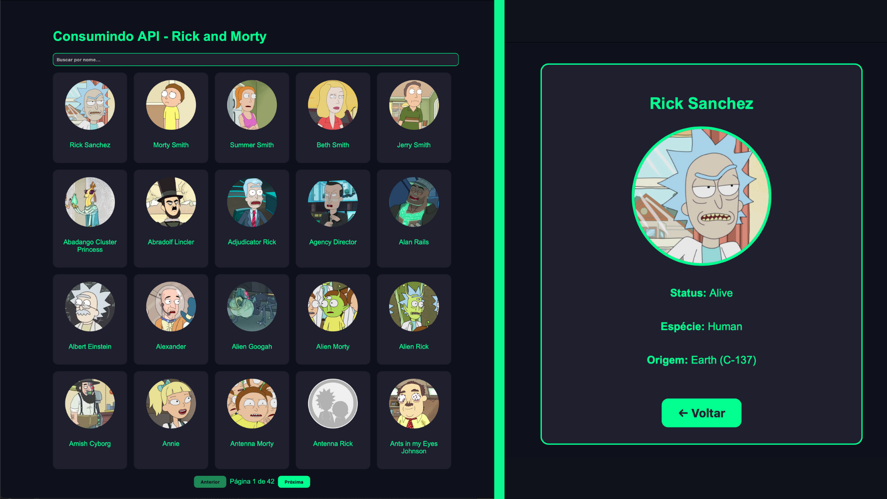

# Rick-And-Morty-ApiSvelte

Aplicação web desenvolvida em **Svelte** que consome a **Rick and Morty API** para exibir informações sobre personagens da série, utilizando **CSS Grid** para um layout moderno e responsivo.

---

## 🖥 Demonstração

[LINK DO SITE PUBLICADO](https://rick-and-morty-api-svelte.vercel.app)




---

## 📖 Sobre o projeto

Este projeto foi criado para praticar e demonstrar:
- O uso do **Svelte** para construção de interfaces reativas.
- Consumo de API externa (**Rick and Morty API**).
- Estilização com **CSS Grid** para exibição em cards.
- Organização de componentes e navegação básica.

O app exibe personagens com:
- **Imagem**
- **Nome**
- **Status (Alive, Dead, Unknown)**
- **Espécie**

---

## 🛠 Tecnologias utilizadas

| Tecnologia         | Finalidade                                       |
|--------------------|-------------------------------------------------|
| **Svelte**         | Framework/Compilador para construção da UI       |
| **Vite**           | Build tool e servidor de desenvolvimento rápido |
| **CSS Grid**       | Layout responsivo para exibir os personagens     |
| **Rick and Morty API** | Fonte dos dados de personagens               |
| **TypeScript** (opcional) | Tipagem estática se estiver habilitado    |

---

## 🚀 Como rodar o projeto

1. Clone o repositório:

   ```bash
   git clone https://github.com/R4elDev/Rick-And-Morty-ApiSvelte.git
   cd Rick-And-Morty-ApiSvelte

2. Instale as dependências:
    ```bash
    npm install

3. Execute o servidor de desenvolvimento:
    ```bash
    npm run dev

4. Gerar build de produção:
    ```bash
    npm run build
    npm run preview

---

## 🤝 Contribuição
Contribuições são bem-vindas!
Se quiser colaborar:
- Faça um fork do repositório.
- Crie uma branch para sua feature/correção (git checkout -b minha-feature).
- Faça commit das alterações (git commit -m 'Minha nova feature').
- Envie para o repositório remoto (git push origin minha-feature).
- Abra um Pull Request descrevendo suas mudanças.
